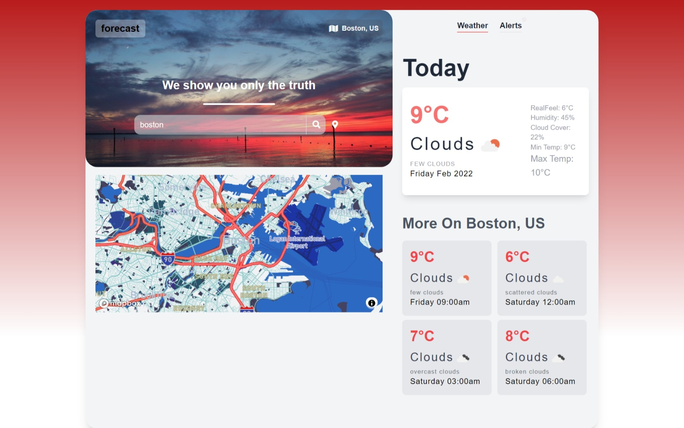

# 🚀  Weather-App With React.Js && Tailwind CSS

Learn how to quickly set up a React project with the Tailwind CSS framework using the [starter kit](https://github.com/labnol/react-tailwind). The project was bootstrapped with Create React App and it uses PurgeCSS to remove all the unused CSS classes from the production build.

# HomePage

# Tokyo Search

# Boston Search

## Live Demo

The [Digital Inspiration](https://digitalinspiration.com/) website is built with the Tailwind CSS, React.js and Gatsby.

[CodeSandbox](https://codesandbox.io/s/github/labnol/react-tailwind) | [Glitch](https://glitch.com/edit/#!/remix/react-tailwindcss) | [Vercel](https://csb-ggfl7-ipit3clvr.vercel.app/)

### Available npm scripts

In the project directory, you can run:

### `npm run start`

Runs the app in the development mode.

Open `http://localhost:3000` to view it in the browser.

The page will reload if you make edits. You will also see any lint errors in the console.

### `npm run build`

Builds the React app for production to the `build` folder. It correctly bundles React in production mode and optimizes the build for the best performance.

The build is minified and the filenames include the hashes. Your app is ready to be deployed!

### `npm run inline`

This command uses `Gulp` to inline all the JavaScript and CSS files from the production build into a single minified file.

### 📧 Contact

The React and Tailwind CSS starter is written by [Amit Agarwal](https://www.labnol.org/about). It is now updated to support Tailwind CSS v2.0.

If you have any questions or feedback, send an email at [amit@labnol.org](mailto:amit@labnol.org?subject=Tailwind+React).
